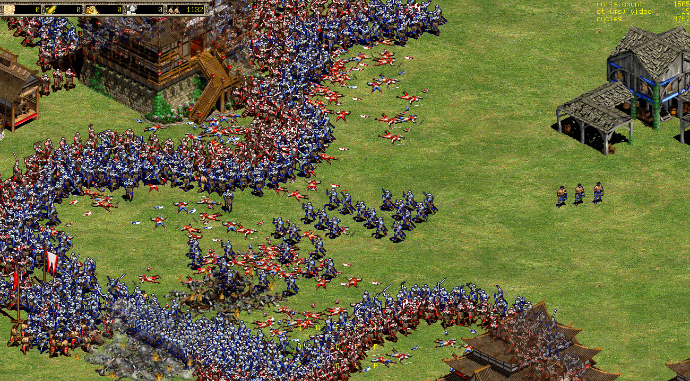

## Open Empires

Open Empires is an educational RTS game engine that interfaces with the Age of Empires II and The Conquerors art assets.

Open Empires is multi-player only and strives to be written in less than 15,000 lines of C99 using only SDL2.

## Legal

Open Empires is *NOT* a binary decompilation of Age of Empires II, and its expansion, The Conquerors.

Data, art, and sound files from Age of Empires II - or its expansion, The Conquerors - are not supplied.
To play Open Empires you must legally own the original boxed-set version of Age of Empires II and The Conquerors,
preferably the Gold Edition.

Age of Empires II and The Conquerors are copyrighted (1999-2000) by Ensemble Studios and Microsoft.
All rights are reserved, as are trademarks of their respective owners.

## Dependencies

    Arch   : pacman -S sdl2 sdl2_net sdl2_ttf
    Ubuntu : apt-get install libsdl2-dev libsdl2-net-dev libsdl2-ttf-dev

## Building

    git clone https://github.com/glouw/openempires
    cd openempires
    make -C src

## Running

First, start the server:

    ./openempires --server

Connections to localhost are currently supported.

Second, start the client by specifying your window resolution and installation data folder path:

    ./openempires --xres 1440 --yres 900 --path "/path/to/data/folder"

## Credits

Thanks to:
* SFTech OpenAge team for their fantastic reverse engineering documentation (https://github.com/SFTtech/openage)
* Ensemble Studios for many gifted childhood memories
* Forgotten Empires for keeping the spirit of Age of Empires II alive

Dedicated to Ondrej whom I met hiking across England as he hiked from Scotland to Spain.

For the Josh Master. Volare, my friend, wherever you are.
