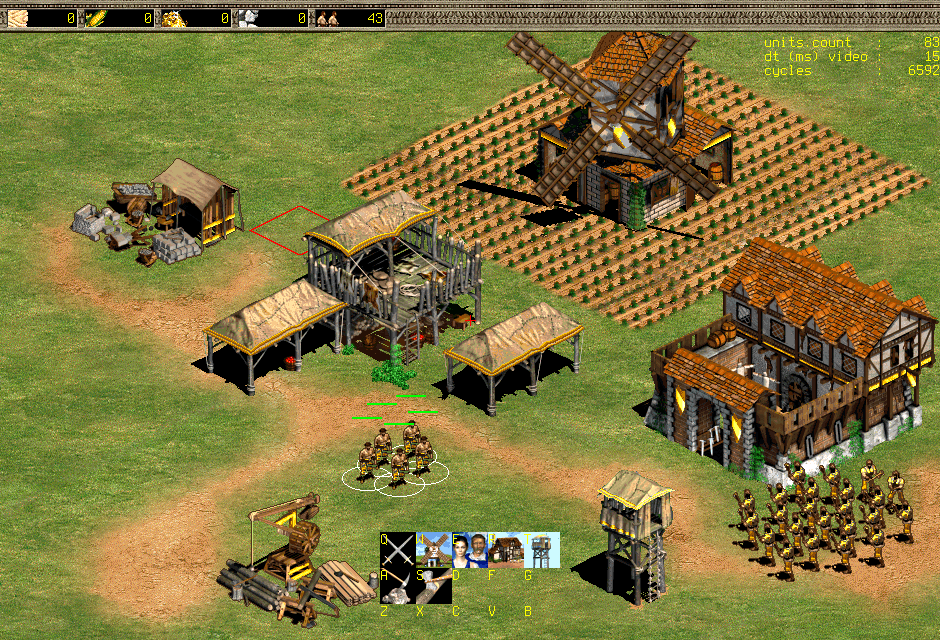

## Open Empires

This is a custom game engine for Age of Empires II written in less than 15,000 lines of C99 using only SDL2.

Open Empires is multiplayer only.

## Legal

Open Empires is *NOT* a binary decompilation of Age of Empires II, and its expansion, The Conquerors.
Open Empires is an educational custom RTS game engine with networking support written from the ground up. 

Open Empires interfaces with the art assets of Age of Empires II and its expansion, The Conquerors.
Data, art, and sound files from Age of Empires II or its expansion, The Conquerors, are not supplied -
to play Open Empires you must legally own the original boxed-set version of Age of Empires II and The Conquerors, preferably the Gold Edition.

Please note that this custom educational game engine, called Open Empires, is neither developed by, nor endorsed by, Ensemble Studios and its parent company Microsoft.
Age of Empires II and The Conquerors is copyright (1999-2000) by Ensemble Studios and Microsoft.
All rights are reserved, as are trademarks of their respective owners.

## Dependencies

    Arch   : pacman -S sdl2 sdl2_net sdl2_ttf
    Ubuntu : apt-get install libsdl2-dev libsdl2-net-dev libsdl2-ttf-dev

## Building

    git clone https://github.com/glouw/openempires
    cd openempires
    make -C src 

## Running

First, start the server:

    ./openempires --server

Connections only to localhost are currently supported.

Second, start the client by specifying your window resolution and installation data folder path:

    ./openempires --xres 1440 --yres 900 --path "/path/to/data/folder"

## Development blog (on hiatus)

http://glouw.com/2019/04/10/Reverse-Engineering-Age-of-Empires-2-Part-0.html

## Credits

Thanks to: 
* SFTech OpenAge team for their fantastic reverse engineering documentation (https://github.com/SFTtech/openage)
* Ensemble Studios for many gifted childhood memories
* Forgotten Empires for keeping the spirit of Age of Empires II alive

Dedicated to Ondrej whom I met hiking across England as he hiked from Scotland to Spain.

For the Josh Master. Volare, my friend, wherever you are.
